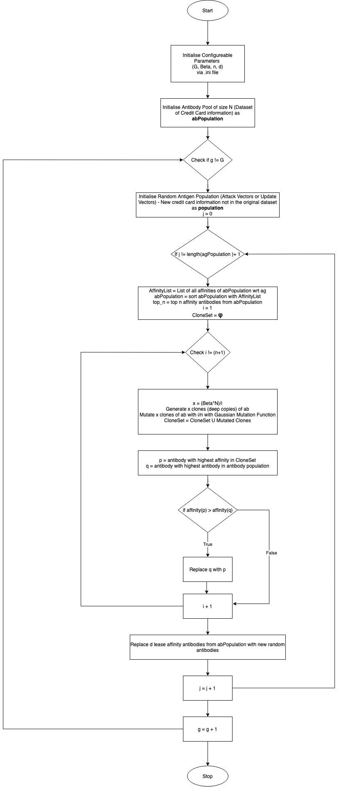
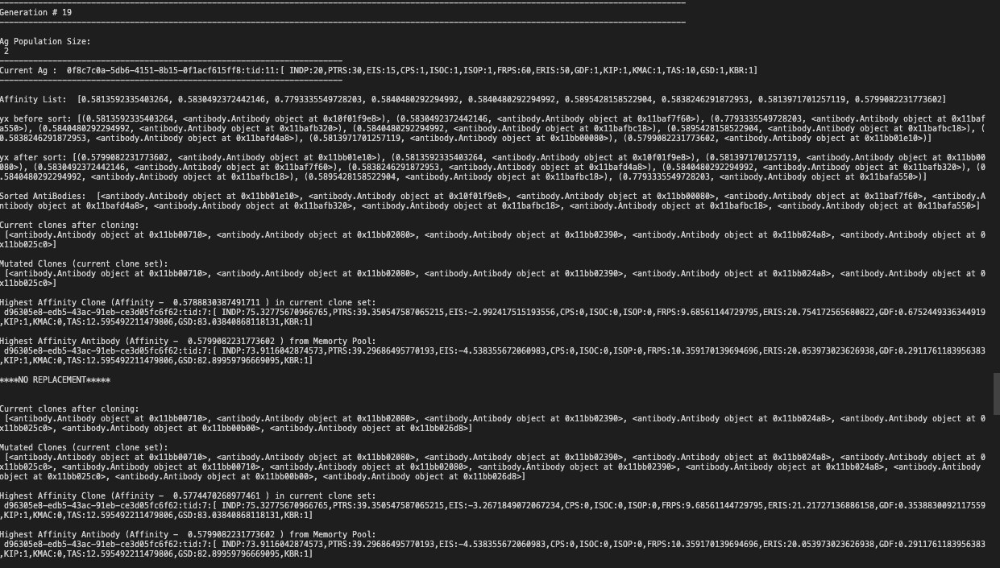
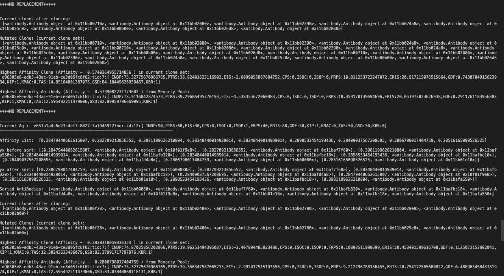
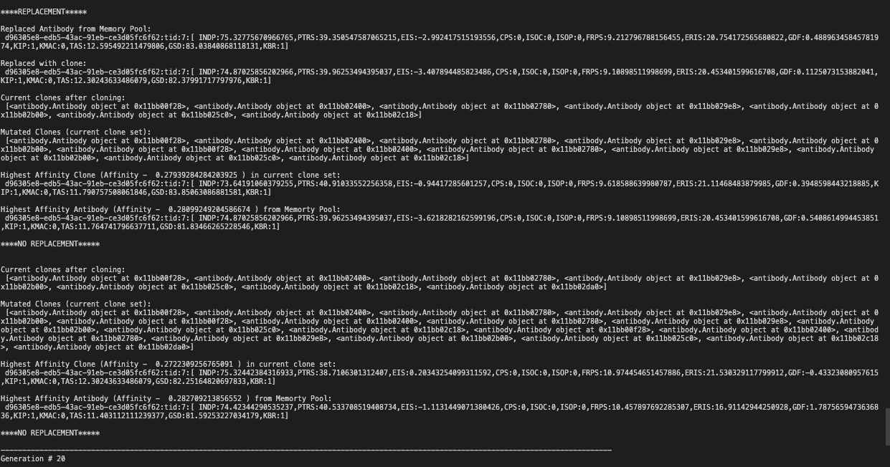

# <span style="color:aqua">ClonalAlgorithmAI</span>
An Algorithm that emulates AIS - Artificial Immune System  (a type of AI Algorithm) to update existing dataset with a set of update vectors or new incoming data

## <span style="color:aqua">About</span>

In this approach to simulate a genetic algorithm - CLONALG to be precise, that uses the evolutionary biology concept of ***Clonal Selection and Affinity Maturation***, an object oriented python script has been implemented using the *Gaussian Function* for Mutation and Randomness wherever required using python's *DEAP - Distributed Evolutionary Algorithms* in Python library

A sample dataset of Credit Card Fraud Transactions Dummy Dataset was created to be used in the implementation of this algorithm that was written from ground up.

All functions have been unit tested to confirm consistency

## <span style="color:aqua">Flowchart</span>



## <span style="color:aqua">Dependancies and Requirements</span>

The code is tested to run with Python 3.7.3

To better manage python versions use python environment

```
$ brew install pyenv
```
Install version that the code has been tested for and activate it
```
$ pyenv install 3.7.3
$ pyenv activate 3.7.3
```
Install the following libraries with pip
```
$ pip install pandas
$ pip install copy
$ pip install operator
$ pip install deap
$ pip install uuid
$ pip install unittest
$ pip install configparser
```
Run unit test to validate the function outputs
```
$ python clonalTest.py
```

Run the main file

```
python clonalScript.py
```

## <span style="color:aqua">Output</span>

The algorithm states are logged at each step. Sample Working for a single generation






